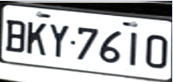
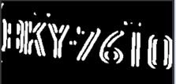

# 車牌辨識系統
  * #### 完整程式碼：[plates-identify](https://github.com/wenchun0731/plates-identify/blob/0ed03460d7c0eed901aac9d1228d4bac7a387add/plates_copy.ipynb)
  * #### 車牌辨識系統介紹簡報：[車牌辨識.pdf](https://github.com/wenchun0731/plates-identify/blob/85bfeabb78b4257100ca84d2a24a5d891e179046/%E8%BB%8A%E7%89%8C%E8%BE%A8%E8%AD%98.pdf)
  * #### 環境：Google Colab 匯入雲端硬碟車牌資料集
  * #### 使用工具：Python+OpenCV+Tesseract-OCR


## 一、介紹
這個系統是適用於架設在路邊的科技執法攝影機，自動辨識車牌字元。
## 二、前提
必須先進行車牌追蹤與擷取，才能使用此車牌辨識系統。

<div align=center>
 
</div>


>  本專題用的是yolov7模型去進行車牌追蹤與擷取，框出車牌區域。
<div align=center>
 
</div>

>將車牌擷取
>開始進行車牌辨識

## 三、問題
由於我們的攝影機是架設在路邊，所以拍攝出來的車牌會是斜的，車牌角度會嚴重影響Tesseract-OCR的字元辨識，所以必須將照片轉正。
## 四、解決方法
使用Python結合OpenCV做仿射變換，將照片轉正。要使用這項技術必須得到車牌的三個角座標，所以後續會進行影像的調整來得到車牌框。

|仿射變換前|仿射變換後|
|----|----|
|||
 
> 仿射變換的前後對比

## 五、影像處理流程
### 1. 尺寸調整
先將原圖進行尺寸的調整，每一張照片尺寸一樣，後續的參數才會適合每一個車牌。

```python
target_width = 300#目標寬度
target_height = 136#目標高度
image = cv2.resize(image, (target_width, target_height))
```

<div align=center>
 
</div>

### 2. 調整亮度與對比度
由於我們是在大自然的環境底下拍攝，所以必須降低對比度與提高光線，減少亮暗的差異，讓整體照片光影較統一。

```python
alpha =-1.5#對比度
beta = 15#亮度
adjusted_image = cv2.convertScaleAbs(image, alpha=alpha, beta=beta)
```

<div align=center>
 
</div>

### 3. 灰階化
以利後續的邊緣檢測Sobel運算。

```python
gray_image = cv2.cvtColor(image,cv2.COLOR_BGR2GRAY)
```

<div align=center>
 
</div>

### 4. 高斯模糊
過濾掉一些微小的噪聲，讓圖像更加乾淨。參數為(3,3)如果覺得不夠可以增加為(5,5)。

```python
kernel_size = (3,3)
sigma_x = 0
blurred_image = cv2.GaussianBlur(gray_image, kernel_size, sigma_x)
```

<div align=center>
 
</div>

### 5. Sobel運算子
我們發現車頭的裝飾物幾乎都是水平線條，所以我們只計算垂直的邊緣，找到車牌左右邊界，再進行後續的處理。

```python
Sobelx=cv2.Sobel(blurred_image,cv2.CV_32F,1,0)
Sobely=cv2.Sobel(blurred_image,cv2.CV_32F,0,1)
Sobelx=cv2.convertScaleAbs(Sobelx)
Sobely=cv2.convertScaleAbs(Sobely)
Sobelxy=cv2.addWeighted(Sobelx,0.5,Sobely,0.5,0)
cv2_imshow(Sobelx)
```

<div align=center>
 
</div>

### 6. 二值化
明確物體的邊界，讓線條更清晰。

```python
thr, binary = cv2.threshold(Sobelx,127, 255, cv2.THRESH_BINARY)
```

<div align=center>
 
</div>

### 7. 找出輪廓
先找出輪廓，再計算每個輪廓的最小矩形、與最小矩形的長度。經過研究發現車牌框長度大概介於圖片的63%~83%之間，也就是以85這個高度來區分車牌框，15是過濾細小輪廓，我們以15跟85這兩個參數來區分車牌框。

```python
contours1 = cv2.findContours(binary, cv2.RETR_EXTERNAL, cv2.CHAIN_APPROX_SIMPLE) #尋找輪廓
contours = contours1[0]   #取得輪廓
cv2.drawContours(img, contours, -1, (0, 255, 0), 2)
letters=[]
for contour in contours:
  x,y,w,h=cv2.boundingRect(contour)
  if 15<h<85: #要改的參數!!!10<h<100
    letters.append(contour)
cv2.drawContours(img, letters, -1, (255, 0, 0), 2)
cv2_imshow(img)
#找出最大x跟最小x
min_x =float('inf')#正無窮
max_x =0
for letter in letters:
  for point in letter:
    x=point[0][0]
    min_x=min(min_x,x)
    max_x=max(max_x,x)
```

<div align=center>
 
</div>

### 8. 裁切
找出左右框之後，切出藍色區域的最小x軸與最大x軸，這樣就完成車牌框裁切了。

```python
#裁切照片
cropped_img=binary[0:binary.shape[0],min_x:max_x]
cropped_image=image[0:binary.shape[0],min_x:max_x]
```

<div align=center>
 
</div>

### 9. 侵蝕
切出車牌字元之後，就開始進行形態學操作，先使用侵蝕消除圖像中的小白躁點。

```python
kernel=np.ones((3, 3),np.uint8)
ero=cv2.erode(cropped_img,kernel,iterations=1)
```

<div align=center>
 
</div>

### 10. 膨脹
填補圖像中的小孔或連接相鄰的輪廓，特別是水平膨脹，使用1X7的矩形結構元素，迭代9次以確保字元與字元之間能閉合。

```python
kernel=np.ones((1, 7),np.uint8)
dilation=cv2.dilate(ero,kernel,iterations=9)
```

<div align=center>
 
</div>

### 11. 計算最小矩形
使用大於2500面積的輪廓計算最小矩形，過濾其他不必要的輪廓，得到矩形四角座標。

```python
contours1 = cv2.findContours(dilation, cv2.RETR_EXTERNAL, cv2.CHAIN_APPROX_SIMPLE) #尋找輪廓
contours = contours1[0]   #取得輪廓

min_contour_length = 2500

# 遍歷所有輪廓
for contour in contours:
    # 計算輪廓的面積
    area = cv2.contourArea(contour)

    # 如果輪廓的面積大於2500，繪製最小外接矩形
    if area >= min_contour_length:
        # 計算輪廓的最小外接矩形
        rect = cv2.minAreaRect(contour)
        points = cv2.boxPoints(rect)
        points = np.int0(points)
```

<div align=center>
 
</div>

### 12. 仿射變換
找到車牌的四個角座標之後，就可以將照片轉正。

```python
p1 = np.float32([(top_left),(top_right),(bottom_right)])
p2 = np.float32([[top_left[0],top_right[1]],(top_right),(bottom_right)])
M = cv2.getAffineTransform(p1, p2)
output = cv2.warpAffine(cropped_image, M,(w,h))
```

<div align=center>
 
</div>

### 13. 裁切
減少上框與圖釘的干擾

```python
x=0
y=top_right[1]
h=bottom_right[1]-top_right[1]
output=output[y-5:y+h,x:x+w]
```

<div align=center>
 
</div>

### 14. Tesseract-OCR字元辨識
最後處理成功。進行字元辨識。完成整個車牌辨識的流程。

```python
Config = r'-c tessedit_char_whitelist=ABCDEFGHIJKLMNOPQRSTUVWXYZ0123456789. --oem 3 --psm 6'
text = pytesseract.image_to_string('/content/output.jpg',lang='eng',config=config)
if len(text) ==1:
  print('辨識失敗')
else:
  clean_text = text.strip()#去除兩端不可見字符
  print('辨識結果:\n{}'.format(clean_text))
```

<div align=center>
 
</div>

## 六、展示
這裡展示的是兩種角度的不同車牌，最後處理效果與辨識結果，可以看到大部分的車牌都能有好的處理結果，辨識結果的準確度就會很高。

|原圖|結果|原圖|結果|
|----|----|----|----|
||||
||||
||||


## 七、文字辨識問題
可以看到這裡車牌的3都被辨識成5。BNT·6302這張是正向的車牌去做影像處理但是辨識結果也是錯的，所以可以得知並不是角度的問題。

|錯誤車牌|
|----|
||
||
||
||

Tesseract OCR 的預設英語（eng）訓練數據集包含了多種常見的字體，像是Times new roman、Arial字體。但是可以看到我們台灣的新式車牌字體，與常見的字體會有些許不同，像是3這個字就差很多。所以後續我們會使用Tesseract-LSTM模型進行車牌字體的訓練，針對特別的字去做一些微調，希望能將系統的辨識準確度提高到9成以上。

|台灣新式車牌字體|Times New Roman|
|----|----|
|||

